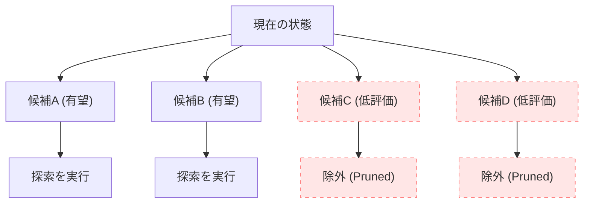
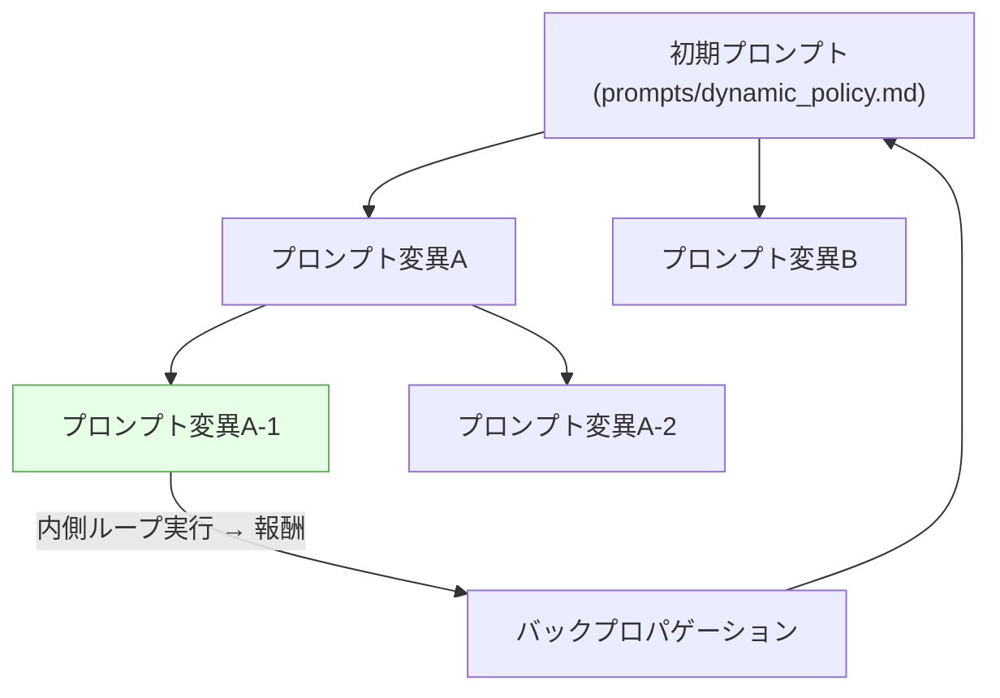

汎用的な木探索フレームワークとして設計された `mcts-gen` ですが、実際に LLM（大規模言語モデル）の推論結果をリアルタイムの探索プロセスに結合した瞬間、致命的な課題に直面しました。それは「探索空間の爆発的な肥大化」と「応答速度の壊滅的な低下」です。

---

## 応答速度のボトルネックと探索空間の爆発

通常の MCTS は、シミュレーション速度が命です。しかし、LLM に現在の盤面状態（または生成途中の化学構造）を送信し、「次に有望な手（あるいは原子）の候補とその確率」を問い合わせる推論処理には、たとえローカルで軽量モデルを動かしたとしても数百ミリ秒から数秒の時間を要します。

1秒間に数万ノードを評価する従来の UCT 探索のループ内に、このような重い推論処理を愚直に挟み込めば、探索エンジンとしての実用性はゼロになります。

また、チェスや将棋のような分岐数の多いドメイン、あるいは結合可能な原子や官能基のバリエーションが無限に存在する分子設計ドメインでは、浅い探索であってもすぐに状態空間が爆発し、適切な解に収束しません。

---

## 方策枝切り (Policy Pruning) という回答

このボトルネックを打破するために導入したのが、**AI による「方策枝切り (Policy Pruning)」** の設計判断です。本プロジェクトでは、この候補削減機構を独自に「Policy Pruning（方策枝切り）」と呼びます。

すべてのノード展開において AI を呼び出すのではなく、探索の初期段階、あるいは特定の「評価が不確実な重要ノード」でのみ LLM に問い合わせを行い、有望と思われる指し手や原子の候補を上位数件に「絞り込む（Pruning）」アプローチを採用しました。



この「方策枝切り (Policy Pruning)」の導入により、探索木全体の幅（分岐数）を狭め、探索全体の深さをより深く掘り下げることを狙いました。

---

## 価値予測 (Value Prediction) とのハイブリッド

さらに、MCTSの終端におけるランダムシミュレーション（ロールアウト）について、特定のタスク（分子/リガンド生成モデルなど）ではこれを廃止し、AIによる「価値予測 (Value Prediction)」（Value Networkによる評価）モデルによる一発評価へと置き換える設計を試みました。なお、ロールアウトを完全に廃止するかどうかは、実装詳細やドメインごとの検証状況によって異なります。

探索の末端に達した際、そこからランダムにゲームを最後までプレイして勝敗を決めるのではなく、AIモデルがその時点での部分的状態（盤面の有利不利、生成された化学物質の合成容易性スコアなど）をダイレクトに評価して数値を返します。

この設計により、限られた推論リソースの中で探索効率を高めることを目指しました。

---

## GPからPrompt-MCTSへの進化：条件コードから自然言語プロンプトへ（2026年8月、v0.0.6）

2026年8月の開発において、`mcts-gen` はさらに重要な質的転換を遂げ、v0.0.6 としてリリースされました。それは、探索木を誘導するロジックの表現形式を「遺伝的プログラミング (GP) 由来の `if_then_else` 条件コードの生成」から、「**ドメイン固有の自然言語プロンプト（Prompt-MCTS）**」へと移行したことです。[^arxiv]

初期の構想では、GPの木構造を模して「LLMに `if_then_else` などの分岐コードをあらかじめ出力させ、それに沿って探索を実行させる」仕様を検討していました。しかし、実際にLLMと対話させながらテストを重ねた結果、重大な事実に気づきました。

- LLMはプログラム実行エンジンではなく、文脈認識と評価を行う**「評価器 (Evaluator)」**である。
- 探索時にLLMにコードを記述させても、LLM自身はコード実行をスキップして直接シミュレーションや盤面評価を自発的に行ってしまう。

そこで、`src/mcts_gen/games/domain_heuristics.py` に `DomainHeuristicManager` クラスと各ドメインのプロンプト定数（`SHOGI_DOMAIN_PROMPT`、`CHESS_DOMAIN_PROMPT`、`LIGAND_DOMAIN_PROMPT`）を定義しました。例えばチェスのプロンプトは次のように自然言語で書かれています。

```
You are a Chess grandmaster assistant guiding an MCTS search.
...
Prioritise in this order:
1. Checkmate or direct King attacks.
2. Tactical combinations (forks, pins, skewers, discovered attacks).
3. Development and castling in the opening phase.
4. Endgame technique (opposition, pawn promotion) in the endgame phase.
```

`DomainHeuristicManager.get_prioritized_moves()` を通じて LLM に候補手を問い合わせ、返答を Python の `ast.literal_eval()` で parse して合法手のリストを並び替えます。これにより `chess_mcts.py`, `shogi_mcts.py`, `ligand_mcts.py` それぞれに自然言語のドメイン知識が注入されるようになりました。[^v006]

---

## 二重ループ構造：内側ループと外側ループ

この Prompt-MCTS の核心的なアーキテクチャは、**2層のループ構造**（内側ループと外側ループ）にあります。この設計思想は、最近発表された研究論文とも共鳴するものです。[^arxiv]

### 内側ループ（Inner Loop）：ゲーム/タスクの探索

内側ループは、これまで説明してきた「通常の MCTS」です。チェスの盤面、将棋の局面、創薬のリガンド構造といったドメイン固有の状態空間を、`DomainHeuristicManager` が提供する自然言語ヒューリスティクスの誘導のもとに探索します。


### 外側ループ（Outer Loop）：プロンプト自体の最適化

外側ループは `src/mcts_gen/core/prompt_mcts.py` に実装された `PromptMCTSOptimizer` です。ここでは**プロンプトのテキスト自体**が「探索対象の状態（State）」です。外側ループは内側ループの実行結果（報酬）をフィードバックとして受け取り、内側ループを誘導するプロンプトそのものを MCTS で最適化します。



`PromptMCTSOptimizer` は以下の MCTS サイクルをプロンプト探索木に適用します：

1. **選択（Select）**：UCB1 スコアで最も有望なプロンプトノードを選ぶ
2. **展開（Expand）**：LLM の mutator（メタプロンプト）を用いてプロンプトを変異させ、子ノードを生成
3. **シミュレーション（Simulate）**：変異後のプロンプトで内側ループを実行し、報酬を取得
4. **逆伝播（Backpropagate）**：報酬をルートまで遡って記録

最終的に最も高い平均報酬を得たプロンプトが `prompts/dynamic_policy.md` に書き出され、次の探索セッションの初期プロンプトとして永続化されます。`AGENTS.md` は静的なガードレールとして機能し、外側ループはこのファイルを変更できません。

また、外側ループの評価器（Evaluator）として **CartPole（Gymnasium）** を採用した `CartPoleEvaluator` を実装し、MCP ツール `run_cartpole_simulation` としても公開しました。CartPole は強化学習の標準ベンチマーク環境であり、プロンプトが生成したポリシーコードの品質をスコア化する汎用的な検証基盤として機能します。

[^arxiv]: 本アーキテクチャが志向する「プロンプトをMCTSで最適化する」アプローチは、近年の研究とも方向性が重なります。例えば Yao et al. (2025) "Optimizing Prompt Sequences using Monte Carlo Tree Search for LLM-Based Optimization" (arXiv:2508.05995) では、MCTSをプロンプトシーケンスの最適化に適用するフレームワーク MCTS-OPS が提案されています。
[^v006]: コード変更の詳細は `mcts-gen` リポジトリにて `git show 47fd820` を実行すると確認できます（v0.0.6リリースコミット、2026年8月15日）。
