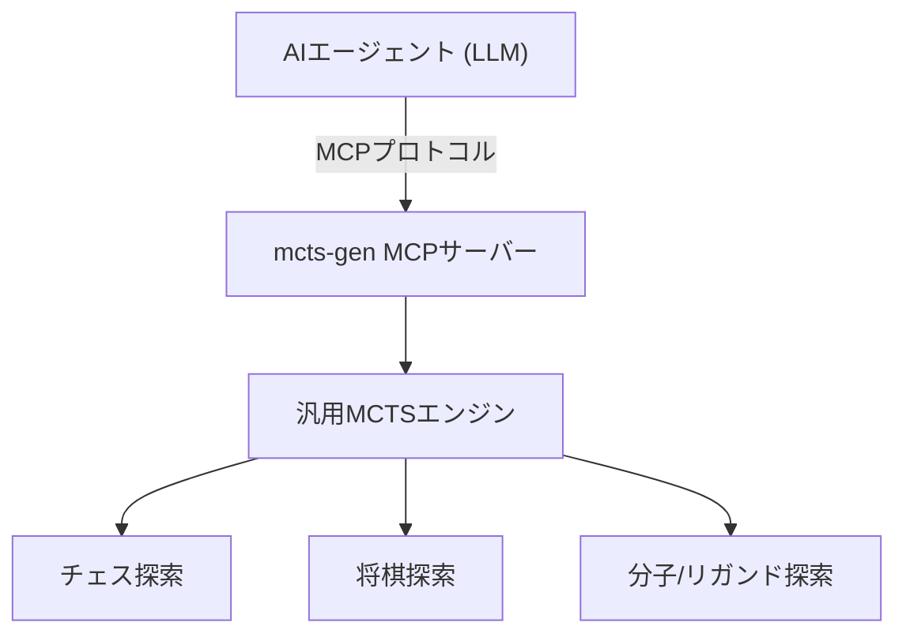

`mcts-gen` プロジェクトの最終フェーズとして取り組んだのが、**Model Context Protocol (MCP)** への対応です。これにより、本システムは単なる「人間が動かすプログラム」から、「外部のAIエージェントが呼び出して使える『思考ツール』」としての統合を試みました。

---

## MCP による AI ツール化

MCP（Model Context Protocol）は、AIエージェント（LLM）に対して外部のコンテキストやツールを標準化されたプロトコルで提供するための仕組みです。

`mcts-gen` を MCP サーバーとしてラップし、AIエージェント用の「ツール」として公開しました。これにより、例えばエージェントは自ら `mcts-gen` を呼び出し、チェスの最善手を深く読ませたり、化学合成可能な分子の構造を探索・シミュレーションさせたりすることが可能になりました。



エージェント自身が自分の推論の限界を補うために、高度なゲーム木探索（あるいは創薬シミュレーション）を「電卓を叩くように」外部にアウトソーシングする。このアーキテクチャは、LLMのトークン効率と探索の正確性を両立させるための一つのアプローチです。

---

## 木探索アルゴリズムの未来

`mcts-gen` の開発を経て、私は「木探索アルゴリズム」と「生成AI」の未来について、確信を深めました。

これまでのAIは、大量のデータからパターンを学習して「直感的に素早く（システム1）」回答を出力することに長けていました。しかし、厳密なルールや正確な論理的推論、チェスや将棋のような「数手先を確実に読む」タスクにおいては、常にハルシネーション（もっともらしい嘘）のリスクと隣り合わせでした。

この課題を解決するのが、生成AIの出力に対して MCTS などの木探索アルゴリズムを結合し、**「論理的かつ深く考える（システム2）」** 能力を与えることです。

`mcts-gen` は、まさにそのための最初の試作フレームワークでした。AIが直感（Policy）で有望な探索の方向を絞り込み、木探索（MCTS）が論理的にその先を深く検証し、再びAIが結論（Value）を評価する。この「直感と論理の協調」こそが、次世代のAI駆動開発における重要なアプローチの一つになると期待されます。

そして、この「AIと探索アルゴリズムの協業」を支えるメタな開発思想こそが、次巻『spec-craft』で解説する「仕様駆動開発」です。

---

## 謝辞：開発・執筆を共にしたAIたち

本プロジェクトの開発、検証、デバッグ、および本技術ノートの執筆・編集にあたっては、以下のAIツール・モデルからの多大な支援と助言を受けました。ここに感謝の意を表します。

* **Gemini (Google)**：`gemini-cli` を介したコマンドライン上での自律開発、Policy Pruningや抽象ドメインインターフェースのリファクタリングの実装支援。
* **ChatGPT (OpenAI)**：UCTコアロジックや創薬シミュレーションにおける状態探索空間についての設計の壁打ち、および全体構成の推敲支援。
* **Perplexity**：LangGraph/LATSなどの構想初期段階における情報調査、および関連文献の整理。
* **Claude (Anthropic)**：仕様書との不整合箇所の指摘、事実関係のレビュー。

以下はGeminiの生成したカバー画像出力コードです：

```python
import os
from PIL import Image, ImageDraw
import math

# Zenn recommended ratio for Book cover: 1 : 1.4 (1000x1400 px)
width = 1000
height = 1400
image = Image.new("RGBA", (width, height), "#0B0F19")
draw = ImageDraw.Draw(image)

# 1. Background Gradient (Dark Navy to Emerald/Cyan tint vertical flow)
for y in range(height):
    # Smooth transition from #0B0F19 to #062E3D (Deep Teal/Cyber green touch for MCTS-Gen)
    r = int(11 + (10 - 11) * (y / height))
    g = int(15 + (50 - 15) * (y / height))
    b = int(25 + (65 - 25) * (y / height))
    for x in range(width):
        draw.point((x, y), fill=(r, g, b, 255))

# 2. Draw Abstract Perspective Grid (Cyber Green / Emerald tint)
grid_color = (16, 185, 129, 35) # Emerald cyber green with alpha
horizon_y = 550
vp_x = width // 2
vp_y = 80

for i in range(-15, 16):
    start_x = vp_x + i * 90
    draw.line([(vp_x, vp_y), (start_x, height)], fill=grid_color, width=1)

# Horizontal lines of perspective grid
for i in range(15):
    y = horizon_y + int((height - horizon_y) * (i / 14) ** 1.8)
    draw.line([(0, y), (width, y)], fill=grid_color, width=1)


# 3. Draw MCTS Tree Structure (Monte Carlo Tree Search Visualization)
# (Root at top, branching down into Policy Pruned / Expanded nodes)
tree_nodes = [
    # Level 0 (Root)
    (500, 700, "root"),

    # Level 1
    (320, 840, "active"),
    (500, 840, "active"),
    (680, 840, "pruned"),

    # Level 2
    (220, 980, "active"),
    (380, 980, "active"),
    (460, 980, "pruned"),
    (540, 980, "best"), # Promising branch
    (620, 980, "pruned"),

    # Level 3 (Deep search)
    (150, 1120, "normal"),
    (270, 1120, "normal"),
    (350, 1120, "normal"),
    (500, 1120, "best"),
    (580, 1120, "best"),

    # Level 4 (AI Value / Leaf prediction)
    (460, 1220, "leaf"),
    (620, 1220, "leaf")
]

# Tree Edges (Connections)
edges = [
    (0, 1, "active"), (0, 2, "active"), (0, 3, "pruned"),
    (1, 4, "active"), (1, 5, "active"),
    (2, 6, "pruned"), (2, 7, "best"), (2, 8, "pruned"),
    (4, 9, "normal"), (4, 10, "normal"),
    (5, 11, "normal"),
    (7, 12, "best"), (7, 13, "best"),
    (12, 14, "leaf"), (13, 15, "leaf")
]

# Draw Edges
for src_idx, dst_idx, edge_type in edges:
    x1, y1, _ = tree_nodes[src_idx]
    x2, y2, _ = tree_nodes[dst_idx]

    if edge_type == "best":
        color = (16, 185, 129, 220) # Bright Emerald Gold
        width_l = 4
    elif edge_type == "active":
        color = (14, 165, 233, 160) # Cyan
        width_l = 2
    elif edge_type == "pruned":
        color = (239, 68, 68, 80) # Light Red (Pruned branch)
        width_l = 1
    else:
        color = (100, 116, 139, 100) # Muted slate blue
        width_l = 1

    draw.line([(x1, y1), (x2, y2)], fill=color, width=width_l)

# Draw Tree Nodes
for x, y, n_type in tree_nodes:
    if n_type == "root":
        # Root node (Large glow, AI Agent core)
        draw.ellipse([x-22, y-22, x+22, y+22], fill="#10B981", outline="#34D399", width=3)
        draw.ellipse([x-35, y-35, x+35, y+35], outline=(16, 185, 129, 60), width=2)
    elif n_type == "best":
        # Highly evaluated path
        draw.ellipse([x-14, y-14, x+14, y+14], fill="#F59E0B", outline="#FBBF24", width=2)
        draw.ellipse([x-22, y-22, x+22, y+22], outline=(245, 158, 11, 80), width=1)
    elif n_type == "active":
        draw.ellipse([x-12, y-12, x+12, y+12], fill="#0EA5E9", outline="#38BDF8", width=2)
    elif n_type == "pruned":
        # Pruned by Policy
        draw.ellipse([x-8, y-8, x+8, y+8], fill="#334155", outline="#EF4444", width=1)
    elif n_type == "leaf":
        # Value evaluation leaf
        draw.ellipse([x-10, y-10, x+10, y+10], fill="#6366F1", outline="#818CF8", width=2)
    else:
        draw.ellipse([x-9, y-9, x+9, y+9], fill="#1E293B", outline="#0EA5E9", width=1)


# 4. Accent Overlay / Modern Frame Lines (Book cover look)
draw.rectangle([60, 60, 940, 1340], outline=(255, 255, 255, 15), width=2)

# Save the generated cover image
output_path = "cover_mcts_gen.png"
image.convert("RGB").save(output_path, "PNG")
print(f"Success: Saved to {output_path}")
```
